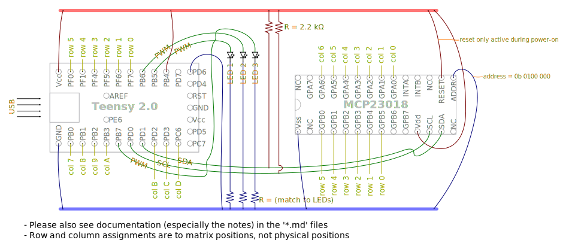

## Circuit Diagram

* Please also see documentation (especially the notes) in the '*.md' files.
* Row and column assignments are to matrix positions, not physical positions.

-------------------------------------------------------------------------------

Copyright &copy; 2013 Ben Blazak <benblazak.dev@gmail.com>  
Released under The MIT License (see "doc/licenses/MIT.md")  
Project located at <https://github.com/benblazak/ergodox-firmware>

